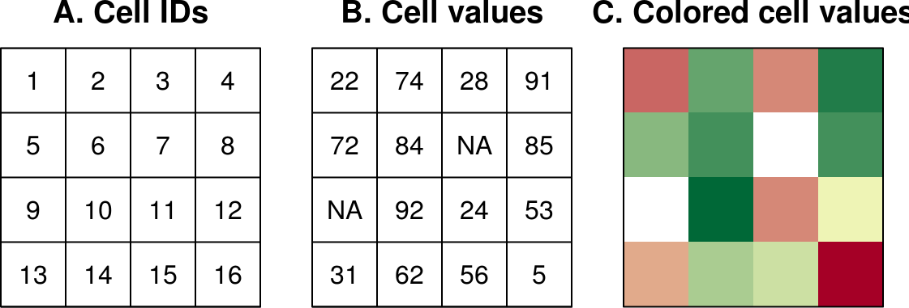
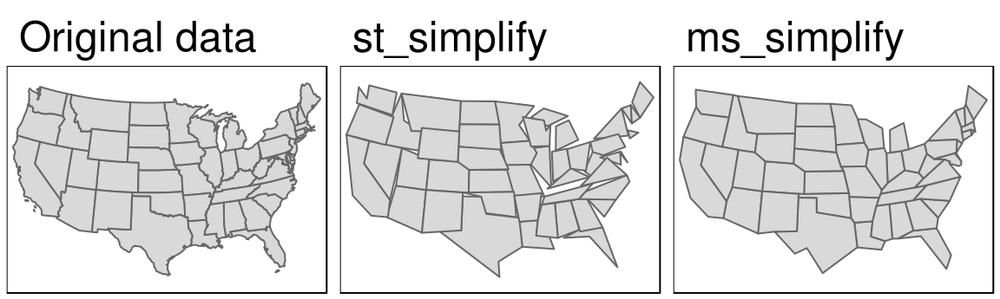
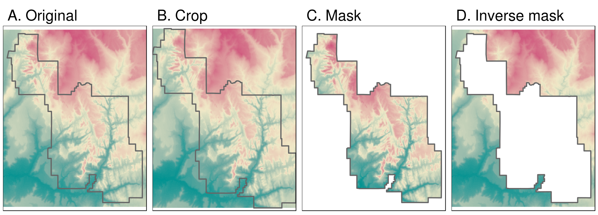
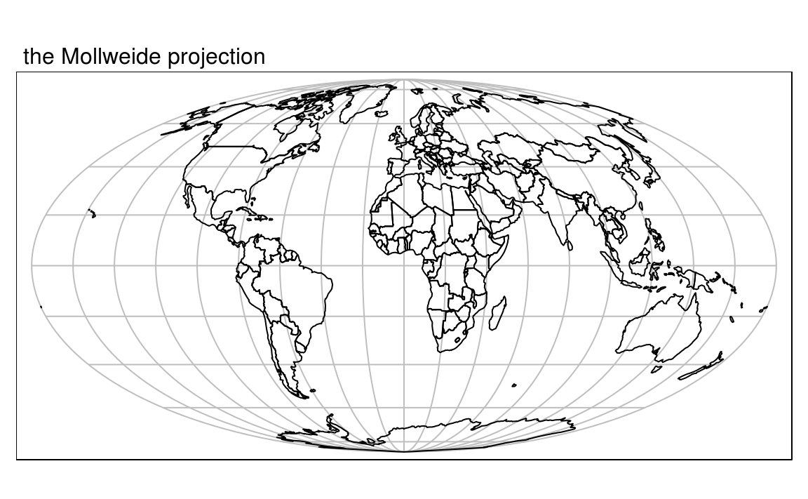
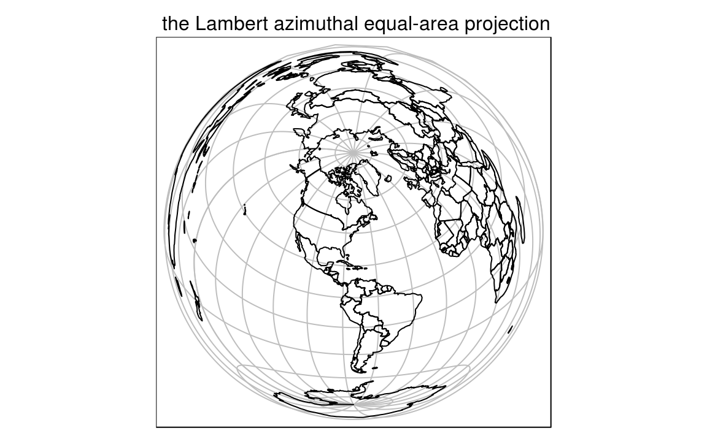
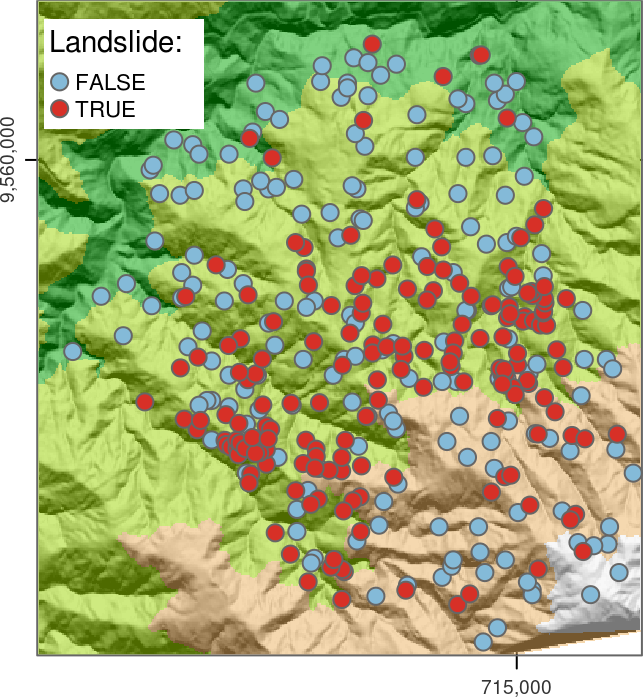
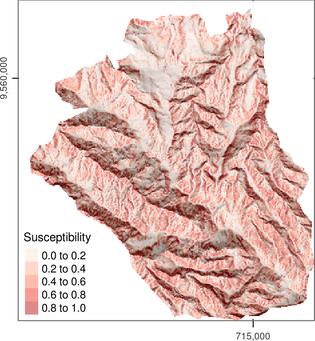
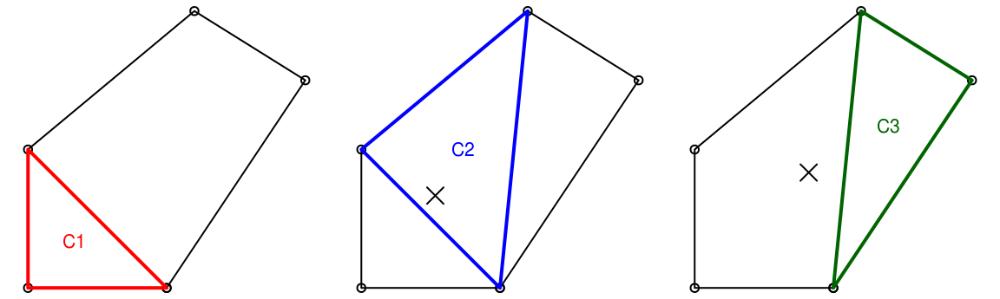
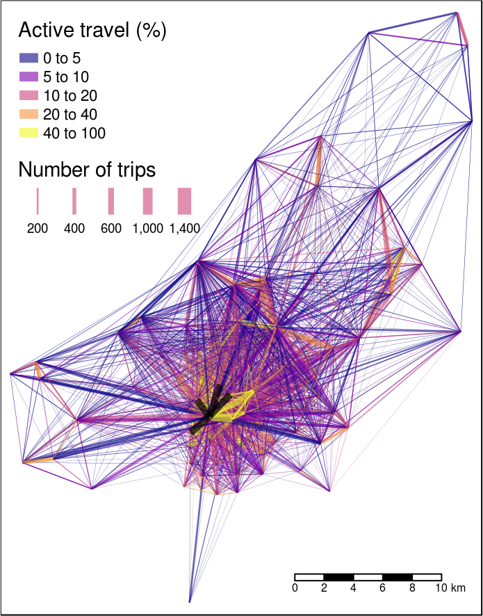

```{r setup, include=FALSE}
options(htmltools.dir.version = FALSE)
knitr::opts_chunk$set(fig.align = "center")
```

# Geocomputation

<!-- grass gis + arc + r -->

```{r gdsl, echo=FALSE, message=FALSE, results='asis'}
d = readr::read_csv('"Caech","GIS (GUI)","R (CLI)"
"Dyscyplina","Geografia","Statystyka, Informatyka"
"Sposób interakcji","Graficzny interfejs użytkownika","Wiersz poleceń"
"Odtwarzalność","Minimalna","Maksymalna"')
knitr::kable(x = d, 
             caption = paste("Różnice pomiędzy oprogramowaniem - graficzny",
                             "interfejs użytkownika (GUI) w programach GIS",
                             "oraz wiersz poleceń (CLI) w R"),
             booktabs = TRUE, 
             format = "html")
```

<!-- how and why -->
<!-- packages and posibilities -->
<!-- Facilitates the automation of repetitive tasks. -->
<!-- Enables transparency and reproducibility, the backbone of good scientific practice and data science. -->
<!-- Encourages software development by providing tools to modify existing functions and implement new ones. -->
<!-- Helps develop future-proof programming skills which are in high demand in many disciplines and industries. -->
<!-- Is user-friendly and fast, allowing an efficient workflow -->

 <!-- This brings us to the ‘open source approach’, which has three main components: -->

 <!--    A command-line interface (CLI), encouraging scripts recording geographic work to be shared and reproduced. -->
 <!--    Open source software, which can be inspected and potentially improved by anyone in the world. -->
 <!--    An active developer community, which collaborates and self-organizes to build complimentary and modular tools. -->


---
# Gecomputation with R

An important feature of R (and Python) is that it is an interpreted language. This is advantageous because it enables interactive programming in a Read–Eval–Print Loop (REPL): code entered into the console is immediately executed and the result is printed, rather than waiting for the intermediate stage of compilation.

Pakiety R:

- **sf**, **raster** - klasy obiektów przestrzennych
- **dplyr**, **rmapshaper** - przetwarzanie tabel atrybutów/geometrii
- **rnaturalearth**, **osmdata**, **getlandsat** - pobieranie danych przestrzennych
- **rgrass7**, **RQGIS**, **RSAGA**, **link2GI** - łączenie z oprogramowaniem GIS
- **gstat**, **mlr**, **CAST** - modelowanie danych przestrzennych
- **rasterVis**, **tmap**, **ggplot** - wizualizacje statyczne
- **leaflet**, **mapview**, **mapdeck** - wizualizacje interaktywne

Więcej na https://cran.r-project.org/web/views/Spatial.html.

---
# Geocomputation with R - książka

.lc[
```{r, out.width=325, echo=FALSE}
knitr::include_graphics("figs/bc.png")
```
]

.rc[
- Lovelace R., Nowosad J., Muenchow J. 2019, **Geocomputation with R**. CRC Press
- Wersja online znajduje się pod adresem https://geocompr.robinlovelace.net/
- Książka zostanie opublikowana w wydawnictwie CRC Press na początku 2019 roku (http://bit.ly/geocomp_with_r)
<br>


]

<!-- intro to the book -->
<!-- links-->
<!-- more about open-source! -->

---
class: inverse, center, middle
# Podstawy

---
# R

<!-- - R + RStudio -->
<!-- - Simple workflow - gif? -->

```{r}
library(sf)
library(spData)
```


---
# Dane wektorowe

.pull-left[
```{r}
library(sf)
```
]


.pull-right[
```{r, echo=FALSE, out.height=550}
knitr::include_graphics("figs/sf-classes.png", dpi = NA)
```
]


---
# Dane rastrowe

```{r}
library(raster)
```

```{r, echo=FALSE}

```


---
# Tworzenie map

```{r, echo=FALSE, out.height=400}
knitr::include_graphics("figs/tmshape-1.png", dpi = NA)
```

---
# Tworzenie map

```{r, echo=FALSE, out.height=400}
knitr::include_graphics("figs/break-styles-1.png", dpi = NA)
```

---
# Tworzenie map

```{r, echo=FALSE, out.height=400}
knitr::include_graphics("figs/inset_map.png", dpi = NA)
```

---
# Tworzenie map

```{r, echo=FALSE, out.height=400}
knitr::include_graphics("figs/urban-facet-1.png", dpi = NA)
```

---
# Tworzenie map

```{r, echo=FALSE, out.height=400}
knitr::include_graphics("figs/cartogram1.png", dpi = NA)
```

---
# Tworzenie map

```{r, echo=FALSE}
library(leaflet)
library(spData)
pal = colorNumeric("RdYlBu", domain = cycle_hire$nbikes)
leaflet(data = cycle_hire) %>% 
  addProviderTiles(providers$Stamen.TonerLite) %>% 
  addCircles(col = ~pal(nbikes), opacity = 0.9) %>% 
  addPolygons(data = lnd, fill = FALSE) %>% 
  addLegend(pal = pal, values = ~nbikes) %>% 
  setView(lng = -0.1, 51.5, zoom = 12) %>% 
  addMiniMap()
```

---
# Operacje geometryczne

```{r, echo=FALSE}

```

---
# Operacje geometryczne

```{r, echo=FALSE, out.height=400}
knitr::include_graphics("figs/centr-1.png", dpi = NA)
```

---
# Operacje geometryczne

```{r, echo=FALSE, out.height=400}
knitr::include_graphics("figs/affine-trans-1.png", dpi = NA)
```

---
# Operacje geometryczne

```{r, echo=FALSE, out.height=400}
knitr::include_graphics("figs/aggregate-example-1.png", dpi = NA)
```

---
# Operacje geometryczne

```{r, echo=FALSE}

```

---
# Reprojekcje

.pull-left[
```{r, echo=FALSE}

```
]

.pull-right[
```{r, echo=FALSE}

```
]


---
class: inverse, center, middle
# Dodatkowe możliwości

---
# Łącznik z oprogramowaniem GIS

.pull-left[
<!--     Has a ‘shallow’ learning curve meaning geographic data can be explored and visualized without hours of learning a new language. -->
<!--     Provides excellent support for ‘digitizing’ (creating new vector datasets), including trace, snap and topological tools.43 -->
<!--     Enables georeferencing (matching raster images to existing maps) with ground control points and orthorectification. -->
<!--     Supports stereoscopic mapping (e.g., LiDAR and structure from motion). -->
<!--     Provides access to geodatabase management systems with object-oriented relational data models, topology and fast (spatial) querying. -->

<!-- Another advantage of dedicated GISs is that they provide access to hundreds of ‘geoalgorithms’ -->

R pozwala na łączenie z oprogramowaniem GIS:
- **rgrass7** - GRASS GIS - ponad 500 funkcji
- **RQGIS** - QGIS  - ponad 1000 funkcji
- **RSAGA** - SAGA GIS - ponad 600 funkcji
- **RPyGeo** - ArcGIS

Dodatkowo możliwe jest tworzenie połączeń z GDALem czy też PostGISem.

```{r, echo=FALSE, message=FALSE, warning=FALSE}
library(scales)
library(sf)
# create two polygons
coords_1 =  
  matrix(data = c(0, 0, 1, 0, 1, 1, 0, 1, 0, 0),
         ncol = 2, byrow = TRUE)
coords_2 =
  matrix(data = c(-0.5, -0.5, 0.5, -0.5, 0.5, 0.5, 
                  -0.5, 0.5, -0.5, -0.5),
         ncol = 2, byrow = TRUE)

# create the first polygon
poly_1 = st_polygon(list((coords_1))) 
# convert it into a simple feature collection 
poly_1 = st_sfc(poly_1)
poly_1 = st_sfc(poly_1, crs = 4326)
# finally, convert it into an sf-object
poly_1 = st_sf(geometry = poly_1, data = data.frame(id = 1))

# create a second polygon
poly_2 = st_polygon(list((coords_2))) %>%
  st_sfc(., crs = 4326) %>%
  st_sf(geometry = ., data = data.frame(id = 1))
union_sf = st_union(poly_1, poly_2)
int = st_intersection(poly_1, poly_2)
diff_1 = st_sym_difference(poly_1, poly_2) %>%
  st_cast("POLYGON")
union_sf_2 = rbind(int, diff_1)
```

```{r, echo=FALSE, message=FALSE, warning=FALSE, fig.height=4}
par(mfrow = c(1, 2))
plot(st_geometry(poly_1), xlim = c(-0.5, 1), ylim = c(-0.5, 1), col = alpha(3, 0.5))
plot(st_geometry(poly_2), add = TRUE, col = alpha(2, 0.5))
plot(st_geometry(union_sf_2), col = alpha(1:3, 0.5))
```
]

.pull-right[
```{r, eval=FALSE}
library(RQGIS)
set_env()
```

```{r, eval=FALSE}
open_help("qgis:union")
get_usage("qgis:union")
```
```
## ALGORITHM: Union
##  INPUT <ParameterVector>
##  INPUT2 <ParameterVector>
##  OUTPUT <OutputVector>
```

```{r, eval=FALSE}
moj_wynik = run_qgis(
  "qgis:union",
  INPUT = poligon1,
  INPUT2 = poligon2,
  OUTPUT = "moj_wynik.shp",
  load_output = TRUE
)
```
]


---
# Przestrzenne uczenie maszynowe

.lc[
```{r, echo=FALSE, out.width="75%"}

```
```{r, echo=FALSE, out.width="75%"}

```
]


.rc[
- TEXT
]


---
# Tworzenie algorytmów przestrzennych

- Skrypt, algorytm i funkcja
- Na przykładzie znajdowania centroidu poligonu:
    1. Podziel poligon na sąsiadujące trójkąty
    2. Znajdź środek każdego trojkąta
    3. Określ obszar każdego trójkąta
    4. Wylicz średnią ważoną powierzchnią środków każdego trójkąta
    
```{r, echo=FALSE}

```


---
class: inverse, center, middle
# Przykłady zastosowania

---
# Analiza transportu


.lc[
```{r, echo=FALSE}

```
]

.rc[
Typically, models are designed to solve a particular problem. For this reason, this chapter is based around a policy scenario, introduced in the next section, that asks: how to increase cycling in the city of Bristol? 

This chapter introduces the geographic analysis of transport systems at different geographic levels, including:

-    Areal units: transport patterns can be understood with reference to zonal aggregates such as the main mode of travel (by car, bike or foot, for example) and average distance of trips made by people living in a particular zone, covered in section 12.3.
-    Desire lines: straight lines that represent ‘origin-destination’ data that records how many people travel (or could travel) between places (points or zones) in geographic space, the topic of section 12.4.
-    Routes: these are lines representing a path along the route network along the desire lines defined in the previous bullet point. We will see how to create them in section 12.5.
-    Nodes: these are points in the transport system that can represent common origins and destinations and public transport stations such as bus stops and rail stations, the topic of section 12.6.
-    Route networks: these represent the system of roads, paths and other linear features in an area and are covered in section 12.7. They can be represented as geographic features (representing route segments) or structured as an interconnected graph, with the level of traffic on different segments referred to as ‘flow’ by transport modelers (Hollander 2016).

]


---
# Analiza geomarketingowa

<!-- - A typical example is where to locate a new shop. The aim here is to attract most visitors and, ultimately, make most profit. There are also many non-commercial applications that can use the technique for public benefit, for example where to locate new health services -->
<!-- - The main task of location analysis is to find out where such ‘optimal locations’ are for specific services, based on available data. Typical research questions include: -->

<!-- -    Where do target groups live and which areas do they frequent? -->
<!-- -    Where are competing stores or services located? -->
<!-- -    How many people can easily reach specific stores? -->
<!-- -    Do existing services over or under-exploit the market potential? -->
<!-- -    What is the market share of a company in a specific area? -->

<!-- This chapter demonstrates how geocomputation can answer such questions based on a hypothetical case study based on real data. -->


<!-- -    Tidy the input data from the German census (section 13.3). -->
<!-- -    Convert the tabulated census data into raster objects (section 13.4). -->
<!-- -    Identify metropolitan areas with high population densities (section 13.5). -->
<!-- -    Download detailed geographic data (from OpenStreetMap, with osmdata) for these areas (section 13.6). -->
<!-- -    Create rasters for scoring the relative desirability of different locations using map algebra (section 13.7). -->

```{r, echo=FALSE, out.height=400}
knitr::include_graphics("figs/08_census_stack.png", dpi = NA)
```

---
# Analiza geomarketingowa

```{r, echo=FALSE, out.height=500}
knitr::include_graphics("figs/08_metro_areas.png", dpi = NA)
```

---
# Analiza geomarketingowa

```{r, echo=FALSE, out.height=500}
knitr::include_graphics("figs/08_result.png", dpi = NA)
```

---
# Analiza ekologiczna

- Intro to lomas (photo?)
- Intro the chapter 
- Results

.pull-left[
```{r, echo=FALSE, out.height=400}
knitr::include_graphics("figs/eco1.png", dpi = NA)
```
]

.pull-right[
```{r, echo=FALSE, out.height=400}
knitr::include_graphics("figs/eco2.png", dpi = NA)
```
]


---
# Analiza ekologiczna

```{r, echo=FALSE, out.height=400}
knitr::include_graphics("figs/eco3.png", dpi = NA)
```

---
class: inverse, center, middle
# Dodatkowe materiały

---
# Rozwiązania zadań

.lc[
- Każdy z rozdziałów zawiera od kilku do kilkunastu zadań do wykonania
- Ich rozwiązania można znaleźć pod adresem https://geocompr.github.io/geocompkg/articles/
]

.rc[
```{r, echo=FALSE, out.height=500}
knitr::include_graphics("figs/exer1.png", dpi = NA)
```
]

---
# Tutoriale

- https://geocompr.github.io/

---
# Blogposty

.lc[
- https://nowosad.github.io/tags/geocompr/
]

.rc[
```{r, echo=FALSE, out.height=500}
knitr::include_graphics("figs/inset_map.png", dpi = NA)
```
]


---
# Blogposty

- https://nowosad.github.io/tags/geocompr/

```{r, echo=FALSE, out.height=500}
knitr::include_graphics("figs/world_pop_1800_2100.gif", dpi = NA)
```

---
# Blogposty

- https://nowosad.github.io/tags/geocompr/

.pull-left[
```{r, echo=FALSE, out.height=500}
knitr::include_graphics("figs/worlds_animate.gif", dpi = NA)
```
]

.pull-right[
dsfds
]


---
class: inverse, center, middle
# Podsumowanie

---
# Podsumowanie

Where next?
- R itself
- discovering geocomputation with other languages
- exploring and learning new research topics and methods


Encourage:

-    The creative use of geographic data.
-    Application to real-world problems.
-    Building ‘scientific’ tools.
-    Reproducibility.


---
class: center, middle
<!-- # Dziękuję -->

.pull-left[
## O mnie:

Twitter: `r icon::ii_social_twitter()` jakub_nowosad

Email: nowosad.jakub@gmail.com
]

.pull-right[
## Więcej informacji:

https://nowosad.github.io

https://geocompr.github.io/

]

